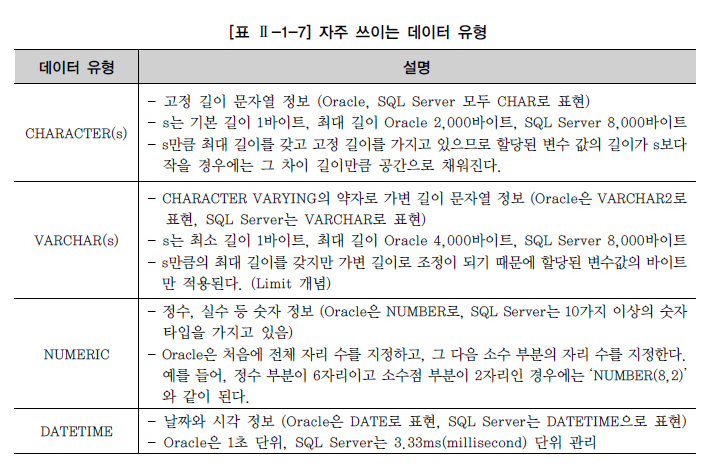
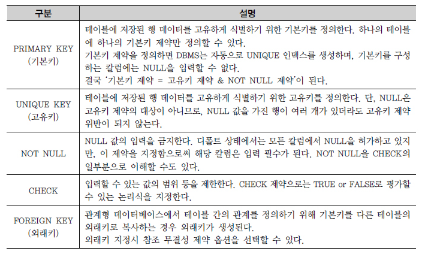

# DDL

## 1.데이터 유형
```
그 칼럼이 받아들일 수 있는 자료의 유형을 규정한다.
 데이터 유형과 더불어 지정한 크기(SIZE)도 중요한 기능을 제공한다.
```


```commandline
CHAR 유형과 VARCHAR 유형 중 어느 유형을 지정하는지에 대한 문제가 자주 논의된다. 
중요한 것은 저장 영역과 문자열의 비교 방법이다.

VARCHAR는 영문 이름이 VARCHAR(40)으로 지정되더라도 
실제 입력되는 문자열의 바이트만 공간을 차지한다.
CHAR는 정확히 얼마의 문자 길이를 사용할지 예측할 수 없는 경우 사용한다.
CHAR에서는 문자열을 비교할 때 공백(BLANK)을 채워서 비교하는 방법을 사용한다. 
```
.

## 2.CREATE TABLE
### 구문형식
```commandline
CREATE　TABLE　테이블이름 ( 
    칼럼명1 DATATYPE [DEFAULT 형식], 
    칼럼명2 DATATYPE [DEFAULT 형식], 
    칼럼명2 DATATYPE [DEFAULT 형식] 
) ;
```

### 제약조건 (CONSTRAINT)
```commandline
제약조건(CONSTRAINT)이란 사용자가 원하는 조건의 데이터만 유지하기 위함이다.
ALTER TABLE을 이용해서 추가,수정하는 경우 데이터가 이미 입력된 경우라면 처리 과정이 쉽지 않으므로 
초기 테이블 생성 시점부터 적합한 제약 조건에 대한 충분한 검토가 있어야 한다.
```


### 생성된 테이블 구조 확인
```commandline
"DESCRIBE 테이블명;" 또는 간략히 "DESC 테이블명";
```

### SELECT 문장을 통한 테이블 생성 사례
```commandline
SELECT 문장을 활용해서 테이블을 생성할 수 있는 방법(CTAS: Create Table ~ As Select ~)이 있다. 
그러나 CTAS 기법 사용시 기존 테이블의 NOT NULL만 새로운 복제 테이블에 적용이 되고, 
기본키, 고유키, 외래키, CHECK 등의 다른 제약 조건은 없어진다.
```
```commandline
EX) CREATE TABLE TEAM_TEMP AS SELECT * FROM TEAM;
```
.

## 3. ALTER TABLE

### ADD COLUMN
```commandline
기존 테이블에 필요한 칼럼을 추가하는 명령이다.
ALTER TABLE PLAYER ADD (ADDRESS VARCHAR2(80)); 
```

### DROP COLUMN
```commandline
DROP COLUMN은 테이블에서 필요 없는 칼럼을 삭제할 수 있으며, 
데이터가 있거나 없거나 모두 삭제 가능하다.
한 번에 하나의 칼럼만 삭제 가능하며, 
칼럼 삭제 후 최소 하나 이상의 칼럼이 테이블에 존재해야 한다.

ALTER TABLE PLAYER ADD (ADDRESS VARCHAR2(80)); 
```

### MODIFY COLUMN
```commandline
칼럼의 데이터 유형, 디폴트(DEFAULT) 값, NOT NULL 제약조건에 대한 변경을 할 수 있다.
ALTER TABLE TEAM_TEMP MODIFY (ORIG_YYYY VARCHAR2(8) DEFAULT '20020129' NOT NULL);
ALTER TABLE PLAYER RENAME COLUMN PLAYER_ID TO TEMP_ID;
```

### TRUNCATE TABLE
```commandline
테이블 자체가 삭제되는 것이 아니고, 해당 테이블에 들어있던 모든 행들이 제거된다.
TRUNCATE TABLE TEAM;
```