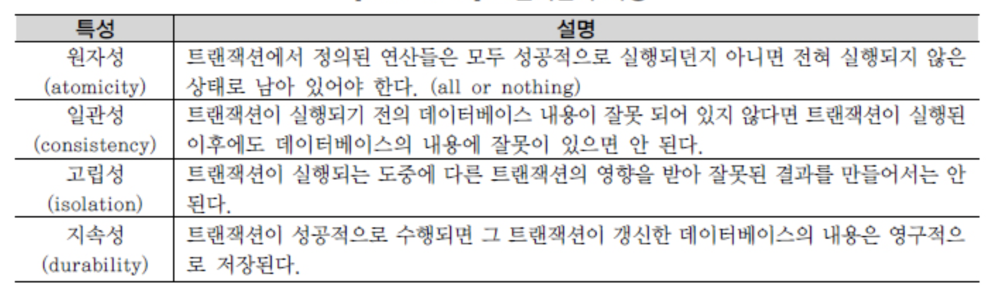
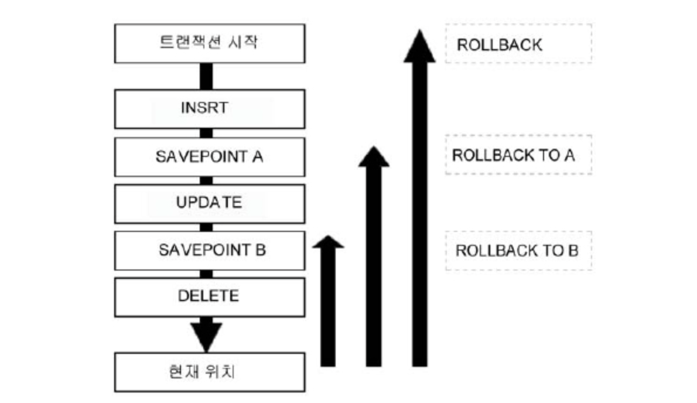
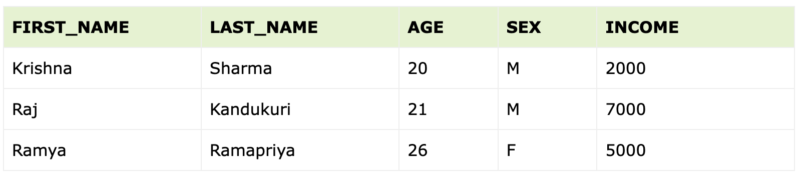

# TCL

## 1. 트랜잭션 개요
```commandline
트랜잭션은(TRANSACTION) 한 개 이상의 데이터베이스 조작을 의미하는 데이터베이스의 '논리적 연산단위'이다. 
트랜잭션은 분할할 수 없는 최소의 단위이며 전부 적용하거나 전부 취소한다. 
즉, TRANSACTION은 ALL OR NOTHING의 개념인 것이다. 

커밋(COMMIT), 롤백(ROLLBACK), 저장점(SAVEPOINT) 3가지 명령어를 트랜잭션을 조작하는 TCL로 분류한다.
```

### 트랜잭션 대상
```commandline
트랜잭션의 대상이 되는 SQL문은 데이터를 수정하는 DML 문이다. ( DDL은 Auto COMMIT )
SELECT 문장은 직접적인 트랜잭션의 대상이 아니지만, SELECT FOR UPDATE와 같은 SELECT문은 트랜잭션의 대상이다. 
```

### 트랜잭션 특성


### 트랜잭션 LOCKING
```commandline
트랜잭션의 특성(특히 원자성)을 충족하기 위해 데이터베이스는 잠금(LOCKING) 기능을 제공하여, 
잠금은 트랜잭션이 수행하는 동안 특정 데이터에 대해서 다른 트랜잭션이 동시에 접근하지 못하도록 제한하는 기법이다. 

잠금이 걸린 데이터는 잠금을 실행한 트랜잭션만 독점적으로 접근할 수 있고 
해당 데이터는 잠금을 수행한 트랜잭션만이 해제할 수 있다.
```


## 2. COMMIT
```commandline
입력 & 수정 & 삭제한 데이터에 대해서 문제가 없다고 판단되었을 경우 COMMIT 명령어를 통해서 트랜잭션을 완료할 수 있다. 

COMMIT 이후의 데이터 상태는 다음과 같다.
- 데이터에 대한 변경 사항이 데이터베이스에 반영된다. 
- 이전 데이터는 영원히 잃어버리게 된다. 
- 모든 사용자는 결과를 볼 수 있다. 
- 관련된 행에 대한 잠금(LOCKING)이 풀리고, 다른 사용자들이 행을 조작(DML)할 수 있게 된다.
```


## 3. ROLLBACK
```commandline
COMMIT 이전에는 변경 사항을 취소할 수 있는데 데이터베이스에서는 롤백(ROLLBACK) 기능을 사용한다. 
롤백(ROLLBACK)은 데이터 변경 사항이 취소되어 이전 상태로 복구되며, 
관련된 행에 대한 잠금(LOCKING)이 풀리고 다른 사용자들이 데이터 변경을 할 수 있게 된다.


ROLLBACK 후의 데이터 상태는 다음과 같다.
- 데이터에 대한 변경 사항은 취소된다. 
- 이전 데이터는 다시 재저장된다. 
- 관련된 행에 대한 잠금(LOCKING)이 풀리고, 다른 사용자들이 행을 조작할 수 있게 된다.

COMMIT과 ROLLBACK을 사용함으로써 다음과 같은 효과를 볼 수 있다.
- 데이터 무결성 보장 
- 영구적인 변경을 하기 전에 데이터의 변경 사항 확인 가능 
- 논리적으로 연관된 작업을 그룹핑하여 처리 가능
```


## 4. SAVEPOINT
```commandline
저장점(SAVEPOINT)을 정의하면 롤백(ROLLBACK)할 때 트랜잭션에 포함된 전체 작업을 롤백하는 것이 아니라 
현 시점에서 SAVEPOINT까지 트랜잭션의 일부만 롤백할 수 있다. 

따라서 복잡한 대규모 트랜잭션에서 에러가 발생했을 때 SAVEPOINT까지의 트랜잭션만 롤백하고 
실패한 부분에 대해서만 다시 실행할 수 있다. 
(일부 툴에서는 지원이 안 될 수 있음) 
복수의 저장점을 정의할 수 있으며, 동일이름으로 저장점을 정의했을 때는 나중에 정의한 저장점이 유효하다. 
```



```commandline
위에서 보듯이 저장점 A로 되돌리고 나서 다시 B와 같이 미래 방향으로 되돌릴 수는 없다. 
‘ROLLBACK TO A’를 실행한 시점에서 저장점 A 이후에 정의한 저장점 B는 존재하지 않는다. 
저장점 지정 없이 “ROLLBACK”을 실행했을 경우 트랜잭션 시작 위치로 되돌아간다.
```

### 예시
결과를 확인할 데이터를 INSERT 한다.
```commandline
INSERT INTO EMP VALUES
('Krishna', 'Sharma', 19, 'M', 2000),
('Raj', 'Kandukuri', 20, 'M', 7000),
('Ramya', 'Ramapriya', 25, 'F', 5000);
```

맨마지막 Mac 이름을 갖는 row을 INSERT 하기 전 Savepoint로 Rollback 한다.
```commandline
START TRANSACTION;

SELECT * FROM EMP;
UPDATE EMP SET AGE = AGE + 1;

SAVEPOINT samplesavepoint;

INSERT INTO EMP ('Mac', 'Mohan', 26, 'M', 2000);

ROLLBACK TO SAVEPOINT samplesavepoint;

COMMIT;
```

Output 결과
```commandline
SELECT * FROM EMP;
```

