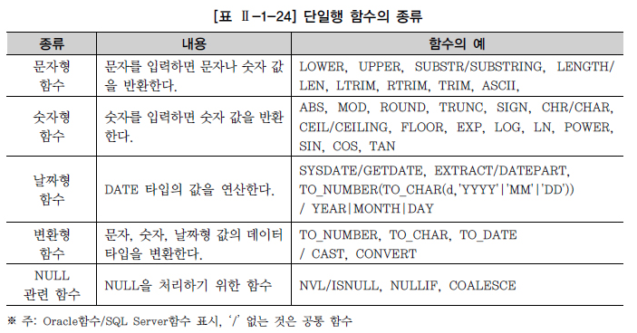
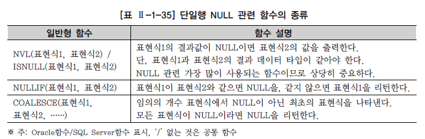

# FUNCTION

## 1. 개요
```commandline
벤더에서 제공하는 함수인 내장 함수(Built-in Function)와 사용자가 정의할 수 있는 함수(User Defined Function)로 나눌 수 있다. 
본 절에서는 각 벤더에서 제공하는 데이터베이스를 설치하면 기본적으로 제공되는 SQL 내장 함수에 대해 설명한다.
```

### 자주 쓰는 함수


### NULL 관련 함수
```commandline
널 값은 아직 정의되지 않은 값으로 0 또는 공백과 다르다. 0은 숫자이고, 공백은 하나의 문자이다. 
테이블을 생성할 때 NOT NULL 또는 PRIMARY KEY로 정의되지 않은 모든 데이터 유형은 널 값을 포함할 수 있다. 
널 값을 포함하는 연산의 경우 결과 값도 널 값이다.

결과값을 NULL이 아닌 다른 값을 얻고자 할 때 NVL/ISNULL 함수를 사용한다. 
NULL 값의 대상이 숫자 유형 데이터인 경우는 주로 0(Zero)으로, 
문자 유형 데이터인 경우는 블랭크보다는 ‘x’ 같이 해당 시스템에서 의미 없는 문자로 바꾸는 경우가 많다.
```

