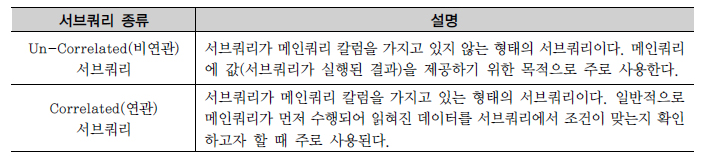
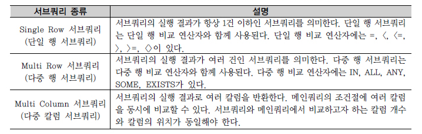

## 서브쿼리 
SubQuery
```commandline
서브쿼리란
서브쿼리는 메인쿼리의 칼럼을 모두 사용할 수 있지만 메인쿼리는 서브쿼리의 칼럼을 사용할 수 없다.
서브쿼리는 서브쿼리 테이블과는 상관없이 항상 메인쿼리 테이블로 결과 집합이 생성된다.

서브쿼리 제약사항
- 서브쿼리를 괄호로 감싸서 사용한다. 
- 서브쿼리는 단일 행(Single Row) 또는 복수 행(Multiple Row) 비교 연산자와 함께 사용 가능하다. 
- 서브쿼리에서는 ORDER BY를 사용하지 못한다.

서브 쿼리 사용 가능한 위치
- SELECT절 - FROM절 - WHERE절 - HAVING절 - ORDER BY절 
- INSERT문의 VALUES절 
- UPDATE문의 SET 절
```
<br/>

#### 동작하는 방식에 따른 서브쿼리 분류
```commandline
- 비연관 서브쿼리
- 연관 서브쿼리
```

<br/><br/>

#### 반환되는 데이터 형태에 따른 서브쿼리 분류
```commandline
- 단일 행 서브쿼리
- 다중 행 서브쿼리
- 다중 컬럼 서브쿼리
```

<br/><br/>

### 1. 단일 행 서브 쿼리
```commandline
서브쿼리가 단일 행 비교 연산자(=, <, <=, >, >=, <>)와 함께 사용할 때는 
서브쿼리의 결과 건수가 반드시 1건 이하이어야 한다.


[ 예시 ]
'정남일' 선수가 소속된 팀의 선수들에 대한 정보를 표시하는 문제
SELECT 
    PLAYER_NAME 선수명, POSITION 포지션, BACK_NO 백넘버 
FROM 
    PLAYER 
WHERE 
    TEAM_ID = (
        SELECT TEAM_ID
        FROM PLAYER
        WHERE PLAYER_NAME = '정남일'
    )

[실행 결과] 
선수명 포지션 백넘버 ------- ----- ----- 
강철 DF 3 
김반 MF 14 
김영수 MF 30 ... 51개의 행이 선택되었다.

정남일 선수의 소속팀을 알아내는 서브쿼리가 먼저 수행되어 정남일 선수의 소속팀 코드가 반환된다. 
```
<br/>

### 2. 다중 행 서브 쿼리
```commandline
서브쿼리의 결과가 2건 이상 반환될 수 있다면 
반드시 다중 행 비교 연산자(IN, ALL, ANY, SOME)와 함께 사용해야 한다.


[예제] 선수들 중에서 ‘정현수’라는 선수가 소속되어 있는 팀 정보를 출력
SELECT 
    REGION_NAME 연고지명, TEAM_NAME 팀명, E_TEAM_NAME 영문팀명 
FROM 
    TEAM 
WHERE 
    TEAM_ID IN (
        SELECT TEAM_ID 
        FROM PLAYER 
        WHERE PLAYER_NAME = '정현수' # 동명이인이 2건 있음
    ) 
ORDER BY TEAM_NAME;

[실행 결과] 
연고지명 팀명 영문팀명 ------ ----- ----------------------- 
전남 드래곤즈 CHUNNAM DRAGONS 
FC 성남 일화천마 SEONGNAM ILHWA CHUNMA FC - 2개의 행이 선택되었다.
```
<br/>

### 3. 다중 칼럼 서프쿼리
```commandline
다중 칼럼 서브쿼리는 서브쿼리의 결과로 여러 개의 칼럼이 반환되어 메인쿼리의 조건과 동시에 비교되는 것을 의미한다.


[ 예제 ] 소속팀별 키가 가장 작은 사람들의 정보를 출력
SELECT 
    TEAM_ID 팀코드, PLAYER_NAME 선수명, POSITION 포지션, BACK_NO 백넘버, HEIGHT 키 
FROM 
    PLAYER 
WHERE 
    (TEAM_ID, HEIGHT) IN (
        SELECT TEAM_ID, MIN(HEIGHT) 
        FROM PLAYER 
        GROUP BY TEAM_ID
    ) 
ORDER BY TEAM_ID, PLAYER_NAME;

[실행 결과] 
팀코드 선수명 포지션 백넘버 키 ----- -------- ------ ---- --- 
K01 마르코스 FW 44 170 
K01 박정수 MF 8 170 
K02 고창현 MF 8 170 ... 19개의 행이 선택되었다.
```
<br/>

### 4. 연관 서브 쿼리
```commandline
연관 서브쿼리(Correlated Subquery)는 서브쿼리 내에 메인쿼리 칼럼이 사용된 서브쿼리이다.


[ 예제 ] 선수 자신이 속한 팀의 평균 키보다 작은 선수들의 정보를 출력
SELECT 
    T.TEAM_NAME 팀명, M.PLAYER_NAME 선수명, M.POSITION 포지션, M.BACK_NO 백넘버, M.HEIGHT 키 
FROM 
    PLAYER M, TEAM T 
WHERE 
    M.TEAM_ID = T.TEAM_ID AND 
    M.HEIGHT < ( 
        SELECT AVG(S.HEIGHT) 
        FROM PLAYER S 
        WHERE S.TEAM_ID = M.TEAM_ID AND S.HEIGHT IS NOT NULL 
        GROUP BY S.TEAM_ID 
    ) 
ORDER BY 선수명;

[실행 결과] 팀명 선수명 포지션 백넘버 키 -------- ----- ----- ----- -- 
삼성블루윙즈 가비 MF 10 177 
삼성블루윙즈 강대희 MF 26 174 
스틸러스 강용 DF 2 179 ... 224의 행이 선택되었다.
```
<br/>

### 5. 그밖의 위치에서 사용하는 서브쿼리
```commandline
1) SELECT 절에서 서브쿼리 사용하기
- SELECT 절에서 사용하는 서브쿼리인 스칼라 서브쿼리는 한 행, 한 칼럼(1Row 1Column)만을 반환하는 서브쿼리를 말한다. 
- 스칼라 서브쿼리(Scalar Subquery)는 칼럼을 쓸 수 있는 대부분의 곳에서 사용할 수 있다


2) FROM 절에서 서브쿼리 사용하기
- FROM 절에서 사용되는 서브쿼리를 인라인 뷰(Inline View)라고 한다.
- 서브쿼리의 결과가 마치 실행 시에 동적으로 생성된 테이블인 것처럼 사용할 수 있다.
- 인라인 뷰를 사용하는 것은 조인 방식을 사용하는 것과 같기에, 인라인 뷰의 서브쿼리의 칼럼은 메인쿼리에서 사용할 수 있다.

[ 예제 ] K-리그 선수들 중에서 포지션이 미드필더(MF)인 선수들의 소속팀명 및 선수 정보를 출력
SELECT 
    T.TEAM_NAME 팀명, P.PLAYER_NAME 선수명, P.BACK_NO 백넘버 
FROM (
    SELECT TEAM_ID, PLAYER_NAME, BACK_NO 
    FROM PLAYER 
    WHERE POSITION = 'MF'
) P, TEAM T 
WHERE 
    P.TEAM_ID = T.TEAM_ID 
ORDER BY 
    선수명;

[실행 결과] 팀명 선수명 백넘버 --------- ------- ----- 
삼성블루윙즈 가비 10 
삼성블루윙즈 강대희 26 
시티즌 강정훈 38 ... 162개의 행


3) HAVING 절에서 서브쿼리 사용하기

4) UPDATE문의 SET 절에서 사용하기

5) INSERT문의 VALUES절에서 사용하기
```
<br/>