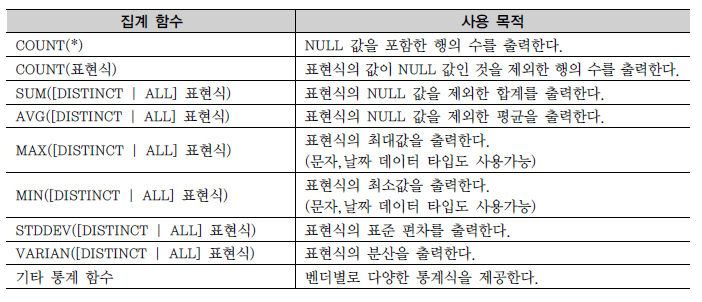

# GROUP BY, HAVING 절

## 1. 집계 함수 (Aggregate Function)
```commandline
여러 행들의 그룹이 모여서 그룹당 단 하나의 결과를 돌려주는 함수이다.
[예제] 
SELECT COUNT(*) "전체행수", COUNT(HEIGHT) "키건수", MAX(HEIGHT) 최대키, MIN(HEIGHT) 최소키, ROUND(AVG(HEIGHT),2) 평균키 
FROM PLAYER;

[실행 결과] 
전체행수 키건수  최대키  최소키  평균키  
480    447   196   165    179.31 


실행 결과를 보면 COUNT(HEIGHT)는 NULL값이 아닌 키(HEIGHT) 칼럼의 건수만 출력하므로 
COUNT(*)의 480보다 작은 것을 볼 수 있다. 
그 이유는 COUNT(*) 함수에 사용된 와일드카드(*)는 전체 칼럼을 뜻하는데 
전체 칼럼이 NULL인 행은 존재할 수 없기 때문에 결국 COUNT(*)는 전체 행의 개수를 출력한 것이고, 
COUNT(HEIGHT)는 HEIGHT 칼럼 값이 NULL인 33건은 제외된 건수의 합이다.
```

### 집계 함수 종류



## 2. GROUP BY 절

```commandline
GROUP BY 절은 SQL 문에서 FROM 절과 WHERE 절 뒤에 오며, 
데이터들을 작은 그룹으로 분류하여 소그룹에 대한 항목별로 통계 정보를 얻을 때 추가로 사용된다.

[ 예제 ]
SELECT [DISTINCT] 칼럼명 [ALIAS명] FROM 테이블명 [WHERE 조건식] [GROUP BY 칼럼(Column)이나 표현식] [HAVING 그룹조건식] ;

[ 조건 ]
- 집계 함수의 통계 정보는 NULL 값을 가진 행을 제외하고 수행한다.
- GROUP BY 절에서는 ALIAS 명을 사용할 수 없다.
- 집계 함수를 사용할 수 있는 GROUP BY 절보다 WHERE 절이 먼저 수행된다. (집계 함수는 WHERE 절에 선언불가 )

```

### 3. HAVING 절
```commandline
[ 예제 1 ]
WHERE 절에는 집계 함수가 허가 되지 않으므로 에러, 이를 위해 HAVING 절 사용
WHERE 절의 조건 변경은 결과 데이터 값이 변경될 수 있지만, 
HAVING 절의 조건 변경은 결과 데이터 변경은 없고 출력되는 레코드의 개수만 변경될 수 있다.

문제 : 선수들의 포지션별 평균키를 구하는데, 평균키가 180 센티미터 이상인 정보만 표시

[ 수정 전 ]
SELECT POSITION 포지션, ROUND(AVG(HEIGHT),2) 평균키 
FROM PLAYER 
WHERE AVG(HEIGHT) >= 180 
GROUP BY POSITION;

[ 수정 후 ]  
SELECT POSITION 포지션, ROUND(AVG(HEIGHT),2) 평균키 
FROM PLAYER 
GROUP BY POSITION 
HAVING AVG(HEIGHT) >= 180;


[ 예제 2 ]
가능하면 WHERE 절에서 조건절을 적용하여 GROUP BY의 계산 대상을 줄이는 것이 효율적인 자원 사용

문제 : 선수들 중 삼성블루윙즈(K02)와 FC서울(K09)의 인원수는 얼마인가?
(수정 전과 수정 후의 결과 값은 같음)
 
[ 수정 전 ]
SELECT TEAM_ID 팀ID, COUNT(*) 인원수 
FROM PLAYER
 WHERE TEAM_ID IN ('K09', 'K02') 
 GROUP BY TEAM_ID;

[ 수정 후 ]
SELECT TEAM_ID 팀ID, COUNT(*) 인원수 
FROM PLAYER 
GROUP BY TEAM_ID 
HAVING TEAM_ID IN ('K09', 'K02');
```

### 4. CASE 표현을 활용한 월별 데이터 집계
```commandline
“집계 함수(CASE( ))~GROUP BY” 기능은, 
모델링의 제1정규화로 인해 반복되는 칼럼의 경우 구분 칼럼을 두고 여러 개의 레코드로 만들어진 집합을, 
정해진 칼럼 수만큼 확장해서 집계 보고서를 만드는 유용한 기법이다.

* 제 1 정규화
1) 테이블의 컬럼이 하나의 값인 원자값(Atomic columns)을 Atomic columns 갖어야 한다.
2) 모든 행은 식별자로 완전하게 구분되어야 한다.


[ 예제 ]
문제 : 부서별로 월별 입사자의 평균 급여를 알고 싶다는 고객의 요구사항

SELECT DEPTNO, 
    AVG(CASE MONTH WHEN 1 THEN SAL END) M01, 
    AVG(CASE MONTH WHEN 2 THEN SAL END) M02, 
    AVG(CASE MONTH WHEN 3 THEN SAL END) M03, 
    AVG(CASE MONTH WHEN 4 THEN SAL END) M04, 
    AVG(CASE MONTH WHEN 5 THEN SAL END) M05, 
    AVG(CASE MONTH WHEN 6 THEN SAL END) M06, 
    AVG(CASE MONTH WHEN 7 THEN SAL END) M07, 
    AVG(CASE MONTH WHEN 8 THEN SAL END) M08, 
    AVG(CASE MONTH WHEN 9 THEN SAL END) M09, 
    AVG(CASE MONTH WHEN 10 THEN SAL END) M10,
    AVG(CASE MONTH WHEN 11 THEN SAL END) M11, 
    AVG(CASE MONTH WHEN 12 THEN SAL END) M12 
FROM (
    SELECT 
        ENAME, DEPTNO, EXTRACT(MONTH FROM HIREDATE) MONTH, SAL 
    FROM EMP
) GROUP BY DEPTNO ;
```

### 5. 집계 함수와 NULL
```commandline
리포트의 빈칸을 NULL이 아닌 ZERO로 표현하기 위해 NVL(Oracle)/ISNULL(SQL Server) 함수를 사용하는 경우가 많은데, 
다중 행 함수(Case When)를 사용하는 경우는 오히려 불필요한 부하가 발생하므로 사용할 필요가 없다.

예를 들면 100명 중 10명의 성적이 NULL 값일 때,
평균을 구하는 다중 행 함수 AVG를 사용하면 NULL 값이 아닌 90명의 성적에 대해서 평균값을 구하게 된다.

SUM(CASE MONTH WHEN 1 THEN SAL ELSE 0 END)처럼 
ELSE 절에서 0(Zero)을 지정하면 불필요하게 0이 SUM 연산에 사용된다.
CASE 표현 사용시 ELSE 절을 생략하게 되면 Default 값이 NULL이다. 

같은 결과를 얻을 수 있다면 가능한 ELSE 절의 상수값을 지정하지 않거나 ELSE 절을 작성하지 않도록 한다.


[ 예제 ]
문제 : 팀별 포지션별 FW, MF, DF, GK 포지션의 인원수와 팀별 전체 인원수를 구하는 SQL 문장을 작성한다. 
      데이터가 없는 경우는 0으로 표시한다.
      
SELECT 
    TEAM_ID, 
    ISNULL(SUM(CASE WHEN POSITION = 'FW' THEN 1 END), 0) FW, 
    ISNULL(SUM(CASE WHEN POSITION = 'MF' THEN 1 END), 0) MF, 
    ISNULL(SUM(CASE WHEN POSITION = 'DF' THEN 1 END), 0) DF, 
    ISNULL(SUM(CASE WHEN POSITION = 'GK' THEN 1 END), 0) GK, 
    COUNT(*) SUM 
FROM PLAYER 
GROUP BY TEAM_ID;
```