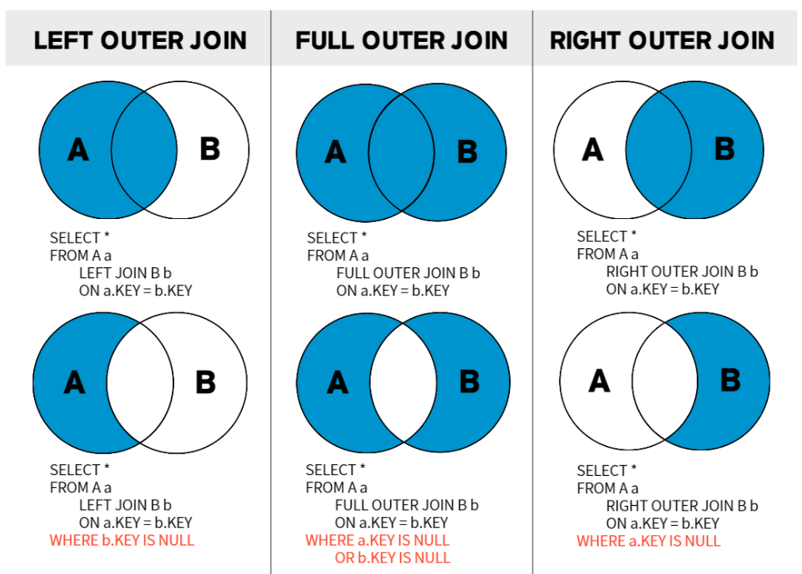
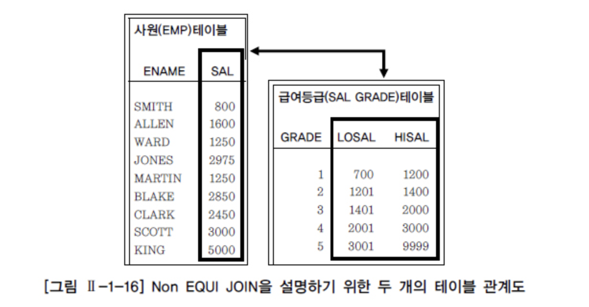
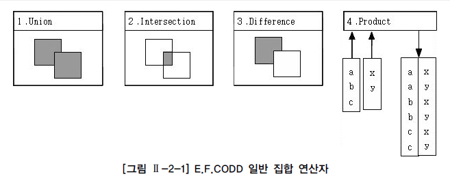

# Join

### 1. 개요
```commandline
FROM 절에 A, B, C 테이블이 나열되었더라도 특정 2개의 테이블만 먼저 조인 처리되고, 
2개의 테이블이 조인되어서 처리된 새로운 데이터 집합과 남은 한 개의 테이블이 다음 차례로 조인된다.

예를 들어 A, B, C, D 4개의 테이블을 조인하고자 할 경우 옵티마이저는 
( ( (A JOIN D) JOIN C) JOIN B)와 같이 순차적으로 조인을 처리하게 된다.
```

<br/> 

### 2. Equi Join
```commandline
- “테이블명.칼럼명”처럼 테이블명과 칼럼명이 같이 나타난다. 
- FROM 절의 테이블에 대해서도 ALIAS를 사용할 수 있다.

예시 ) inner join 
SELECT A.칼럼명, B.칼럼명, ... 
FROM 테이블1 A INNER JOIN 테이블2 B 
ON A.칼럼명1 = B.칼럼명2; → ON 절에 JOIN 조건을 넣는다.


- WHERE 절에서 JOIN 조건 이외의 검색 조건에 대한 제한 조건을 덧붙여 사용할 수 있다.
예시 ) 포지션이 골키퍼인(골키퍼에 대한 포지션 코드는 ‘GK’임) 선수들에 대한 데이터만을 백넘버 순으로 출력
SELECT P.PLAYER_NAME 선수명, P.BACK_NO 백넘버, T.REGION_NAME 연고지, T.TEAM_NAME 팀명 
FROM PLAYER P, TEAM T 
WHERE P.TEAM_ID = T.TEAM_ID AND P.POSITION = 'GK' 
ORDER BY P.BACK_NO; 


예시 ) Inner Join으로 위 SQL 표현시
SELECT P.PLAYER_NAME 선수명, P.BACK_NO 백넘버, T.REGION_NAME 연고지, T.TEAM_NAME 팀명 
FROM PLAYER P INNER JOIN TEAM T 
ON P.TEAM_ID = T.TEAM_ID 
WHERE P.POSITION = 'GK' 
ORDER BY P.BACK_NO;


- 테이블에 대한 ALIAS를 적용해서 SQL 문장을 작성했을 경우, 
WHERE 절과 SELECT 절에는 테이블명이 아닌 테이블에 대한 ALIAS를 사용해야 한다.
```
<br/>

### 3. Non EQUI JOIN
```commandline
- Non EQUI(비등가) JOIN은 두 개의 테이블 간에 칼럼 값들이 서로 정확하게 일치하지 않는 경우에 사용된다.
- “=” 연산자가 아닌 다른(Between, >, >=, <, <= 등) 연산자들을 사용하여 JOIN을 수행하는 것이다.

예시 ) 
SELECT E.ENAME, E.JOB, E.SAL, S.GRADE 
FROM EMP E, SALGRADE S 
WHERE E.SAL BETWEEN S.LOSAL AND S.HISAL;

사원(EMP) 테이블에서 사원들의 급여가 
급여등급(SALGRADE) 테이블의 등급으로 표시되기 위해서는 
“=” 연산자로 JOIN을 이용할 수가 없다. 
```

<br/>

### 4. 3개 이상 TABLE JOIN
```commandline
예제)
SELECT 
    P.PLAYER_NAME 선수명, P.POSITION 포지션, 
    T.REGION_NAME 연고지, T.TEAM_NAME 팀명, 
    S.STADIUM_NAME 구장명 
FROM PLAYER P, TEAM T, STADIUM S 
WHERE 
    P.TEAM_ID = T.TEAM_ID AND 
    T.STADIUM_ID = S.STADIUM_ID 
ORDER BY 선수명; 


예제 ) INNER JOIN을 명시하여 사용할 수도 있다. 
SELECT 
    P.PLAYER_NAME 선수명, P.POSITION 포지션, 
    T.REGION_NAME 연고지, T.TEAM_NAME 팀명, 
    S.STADIUM_NAME 구장명 
FROM PLAYER P 
INNER JOIN TEAM T 
ON P.TEAM_ID = T.TEAM_ID 
INNER JOIN STADIUM S 
ON T.STADIUM_ID = S.STADIUM_ID 
ORDER BY 선수명;
```
<br/>

### 5. 표준 조인
```commandline
- 집합연산자
1. UNION은 합집합을 제공하기 위해, 공통 교집합의 중복을 없애기 위한 작업으로 시스템에 부하를 주는 정렬 작업이 발생한다. 
UNION ALL 기능이 추가되었는데, 공통집합을 중복해서 그대로 보여 주기 때문에 정렬 작업이 일어나지 않는 장점을 가진다. 
만일 UNION과 UNION ALL의 출력 결과가 같다면, 응답 속도, 자원 효율화 측면에서 UNION ALL을 사용하는 것을 권고한다.

2. INTERSECTION은 수학의 교집합으로써 두 집합의 공통집합을 추출한다.
3. DIFFERENCE는 수학의 차집합으로써 첫 번째 집합에서 두 번째 집합과의 공통집합을 제외한 부분이다. 
4. PRODUCT의 경우는 CROSS(ANIS/ISO 표준) PRODUCT라고 불리는 곱집합으로, 
JOIN 조건이 없는 경우 생길 수 있는 모든 데이터의 조합을 말한다. 양쪽 집합의 M*N 건의 데이터 조합이 발생한다.
```

<br/>
