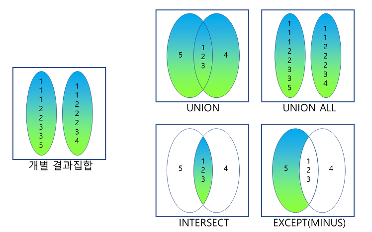

## 집합 연산자 ( Sep Operator )

### 1. 개요
```commandline
- 조인을 사용하지 않고 연관된 데이터 조회가 가능
- 집합 연산자는 2개 이상의 질의 결과를 하나의 결과로 만듬
- 집합 연산자를 사용하기 위해서는 다음 제약조건을 만족해야 함
 ㄴ SELECT 절의 칼럼 수가 동일
 ㄴ SELECT 절의 동일 위치에 존재하는 칼럼의 데이터 타입이 상호 호환 가능 (반드시 동일한 데이터 타입일 필요는 없음)
 ㄴ 위 두조건에 맞지 않으면 데이터베이스가 오류를 반환
```
<br/>

### 2. 종류
```commandline
- UNION
- UNION ALL
- INTERSECT
- EXCEPT

- UNION ALL을 제외한 다른 집합 연산자에서는 
  SQL문의 결과 집합에서 먼저 중복된 건을 배제하는 작업을 수행한 후에 집합 연산을 적용
```

<br/>

### 3. 예제
```commandline
- ORDER BY는 집합 연산을 적용한 최종 결과에 대한 정렬 처리이므로 가장 마지막 줄에 한번만 기술

[ 형식 ]
SELECT 칼럼명1, 칼럼명2, ... 
FROM 테이블명1 
[WHERE 조건식 ] 
[[GROUP BY 칼럼(Column)이나 표현식 [HAVING 그룹조건식 ] ] 
집합 연산자 
SELECT 칼럼명1, 칼럼명2, ... 
FROM 테이블명2 [WHERE 조건식 ] 
[[GROUP BY 칼럼(Column)이나 표현식 [HAVING 그룹조건식 ] ] 
[ORDER BY 1, 2 [ASC또는 DESC ] ; 

SELECT PLAYER_NAME 선수명, BACK_NO 백넘버 
FROM PLAYER 
WHERE TEAM_ID = 'K02' 
UNION 
SELECT PLAYER_NAME 선수명, BACK_NO 백넘버 
FROM PLAYER 
WHERE TEAM_ID = 'K07' 
ORDER BY 1;
```
```commandline
- 합집합은 WEHRE 'IN', 'OR' 으로 대체할 수 있음 

[질문]
K-리그 소속 선수들에 대한 정보 중에서 포지션별 평균키와 팀별 평균키를 알고 싶다. 
K-리그 소속 선수 중 포지션별 평균키에 대한 집합과K-리그 소속 선수 중 팀별 평균키에 대한 집합의 합집합

[예제]
SELECT 'P' 구분코드, POSITION 포지션, AVG(HEIGHT) 평균키 
FROM PLAYER 
GROUP BY POSITION 
UNION 
SELECT 'T' 구분코드, TEAM_ID 팀명, AVG(HEIGHT) 평균키 
FROM PLAYER 
GROUP BY TEAM_ID 
ORDER BY 1;
```
```commandline
- 차집합은 앞의 집한의 결과에서 뒤의 집합의 결과를 뺌
- WHERE 'NOT IN'으로 대체 가능

[질문]
K-리그 소속 선수를 중에서 소속이 삼성블루윙즈팀이면서 포지션이 미드필더(MF)가 선수들의 정보를 보고 싶다.
K-리그 소속 선수 중 소속이 삼성블루윙즈팀인 선수들의 집합과 K-리그 소속 선수 중 포지션이 미드필더(MF))인 선수들의 집합의 차집합

[예제]
삼성블루윙즈팀의 선수들 중에서 포지션이 미드필더(MF)인 선수들의 정보를 빼는 것
 
SELECT TEAM_ID 팀코드, PLAYER_NAME 선수명, POSITION 포지션, BACK_NO 백넘버, HEIGHT 키 
FROM PLAYER 
WHERE TEAM_ID = 'K02' 
EXCEPT
SELECT TEAM_ID 팀코드, PLAYER_NAME 선수명, POSITION 포지션, BACK_NO 백넘버, HEIGHT 키 
FROM PLAYER 
WHERE POSITION = 'MF' 
ORDER BY 1, 2, 3, 4, 5;
```

```commandline
- 교집합 (INTERSECT) 
- WHERE 'IN', 'AND'로 대체 가능
[질문] 
K-리그 소속 선수들 중에서 소속이 삼성블루윙즈팀이면서 포지션이 골키퍼(GK)인 선수들의 정보를 보고 싶다. 
K-리그 소속 선수 중 소속이 삼성블루윙즈팀인 선수들의 집합과 K-리그 소속 선수 중 포지션이 골키퍼(GK)인 선수들의 집합의 교집합

[예제]
소속이 삼성 블루윙즈팀인 선수의 집합이면서 포지션이 골키퍼인 집합인 두 개의 조건을 만족하는 집합

SELECT TEAM_ID 팀코드, PLAYER_NAME 선수명, POSITION 포지션, BACK_NO 백넘버, HEIGHT 키 
FROM PLAYER 
WHERE TEAM_ID = 'K02' 
INTERSECT 
SELECT TEAM_ID 팀코드, PLAYER_NAME 선수명, POSITION 포지션, BACK_NO 백넘버, HEIGHT 키 
FROM PLAYER 
WHERE POSITION = 'GK' 
ORDER BY 1, 2, 3, 4, 5;
```

