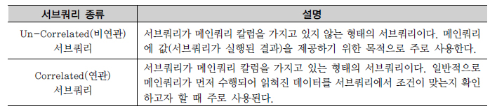
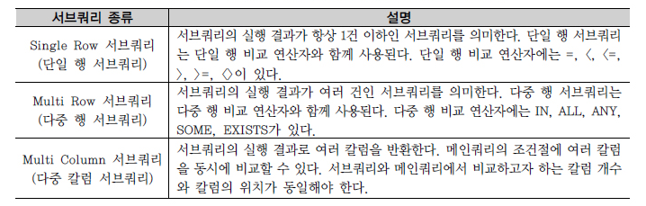

## 서브쿼리 
SubQuery
```commandline
서브쿼리란
서브쿼리는 메인쿼리의 칼럼을 모두 사용할 수 있지만 메인쿼리는 서브쿼리의 칼럼을 사용할 수 없다.
서브쿼리는 서브쿼리 테이블과는 상관없이 항상 메인쿼리 테이블로 결과 집합이 생성된다.

서브쿼리 제약사항
- 서브쿼리를 괄호로 감싸서 사용한다. 
- 서브쿼리는 단일 행(Single Row) 또는 복수 행(Multiple Row) 비교 연산자와 함께 사용 가능하다. 
- 서브쿼리에서는 ORDER BY를 사용하지 못한다.

서브 쿼리 사용 가능한 위치
- SELECT절 - FROM절 - WHERE절 - HAVING절 - ORDER BY절 
- INSERT문의 VALUES절 
- UPDATE문의 SET 절
```
<br/>

#### 동작하는 방식에 따른 서브쿼리 분류
```commandline
- 비연관 서브쿼리
- 연관 서브쿼리
```

<br/><br/>

#### 반환되는 데이터 형태에 따른 서브쿼리 분류
```commandline
- 단일 행 서브쿼리
- 다중 행 서브쿼리
- 다중 컬럼 서브쿼리
```

<br/><br/>